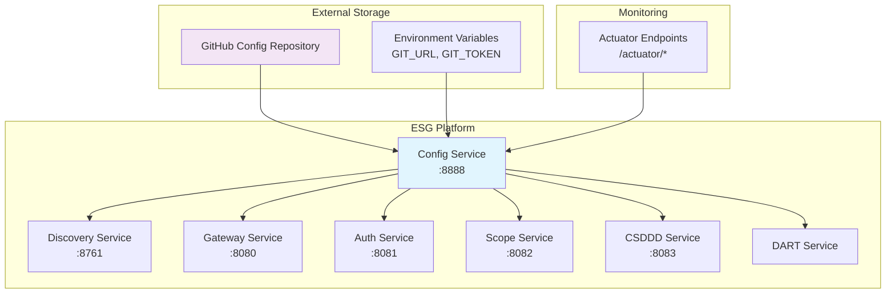
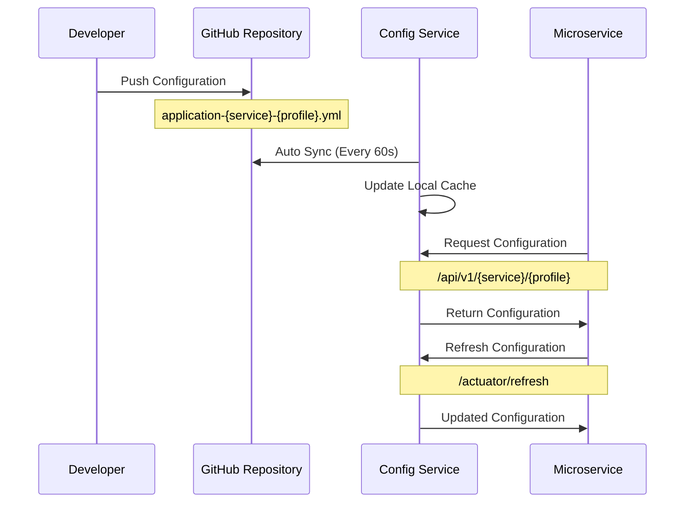

# Config Service - 중앙집중식 설정 관리 서버

**포트폴리오 프로젝트**: ESG 플랫폼 - 마이크로서비스 설정 관리 시스템

## 프로젝트 개요

Config Service는 ESG 플랫폼의 **중앙집중식 설정 관리 서버**로, Spring Cloud Config를 기반으로 모든 마이크로서비스의 설정을 통합 관리합니다. Git 저장소를 백엔드로 사용하여 환경별 설정 분리, 동적 설정 갱신, 보안 인증을 제공하는 핵심 인프라 서비스입니다.

### 핵심 기능

- **Git 기반 설정 저장소**: GitHub 저장소에서 모든 마이크로서비스 설정 파일 중앙 관리
- **환경별 설정 분리**: 개발/테스트/운영 환경별 독립적인 설정 관리
- **동적 설정 갱신**: 런타임 중 서비스 재시작 없이 설정 변경 적용
- **보안 인증**: Git 토큰 기반 안전한 설정 저장소 접근
- **자동 동기화**: 60초마다 Git 저장소와 자동 동기화

### 기술 스택

[](https://spring.io/projects/spring-boot)
[](https://spring.io/projects/spring-cloud)
[](https://openjdk.java.net/)
[](https://gradle.org/)
[](https://spring.io/projects/spring-cloud-config)
[](https://docs.spring.io/spring-boot/docs/current/reference/html/features.html#features.profiles)
[](https://spring.io/projects/spring-cloud-netflix)

## 시스템 아키텍처

### 마이크로서비스 구조



### 설정 관리 플로우



## 설정 관리 시스템

### Git 저장소 구조

```
config-repository/
├── application.yml                    # 공통 설정
├── application-dev.yml               # 개발 환경 공통 설정
├── application-prod.yml              # 운영 환경 공통 설정
├── gateway-service.yml               # Gateway 기본 설정
├── gateway-service-dev.yml           # Gateway 개발 설정
├── gateway-service-prod.yml          # Gateway 운영 설정
├── auth-service.yml                  # Auth 기본 설정
├── auth-service-dev.yml              # Auth 개발 설정
├── scope-service.yml                 # Scope 기본 설정
├── scope-service-dev.yml             # Scope 개발 설정
└── csddd-service.yml                 # CSDDD 기본 설정
```

### 설정 파일 네이밍 규칙

| 패턴 | 설명 | 예시 |
|------|------|------|
| `application.yml` | 모든 서비스 공통 설정 | 로깅, 공통 속성 |
| `application-{profile}.yml` | 환경별 공통 설정 | DB 연결, 외부 API |
| `{service}.yml` | 서비스별 기본 설정 | 포트, 서비스명 |
| `{service}-{profile}.yml` | 서비스/환경별 설정 | 개발DB, 운영DB |

## 환경 변수 설정

### 필수 환경 변수

```bash
# Git 저장소 설정
export GIT_URL=https://github.com/your-org/esg-config-repo.git
export GIT_ID=your-github-username
export GIT_TOKEN=your-github-personal-access-token

# 서비스 설정
export CONFIG_SERVICE_PORT=8888
export LOGGING_LEVEL=INFO
```

### GitHub Personal Access Token 권한

Config Service에서 사용하는 GitHub 토큰은 다음 권한이 필요합니다:

- **repo**: 프라이빗 저장소 접근 (필요시)
- **contents**: 저장소 내용 읽기/쓰기
- **metadata**: 저장소 메타데이터 읽기

## API 엔드포인트

### 설정 조회 API

| HTTP Method | Endpoint | 설명 | 응답 형식 |
|-------------|----------|------|-----------|
| GET | `/{application}/{profile}` | 서비스별 프로파일 설정 조회 | JSON |
| GET | `/{application}/{profile}/{label}` | 특정 브랜치/태그 설정 조회 | JSON |
| GET | `/{application}-{profile}.yml` | YAML 형식 설정 조회 | YAML |
| GET | `/{application}-{profile}.properties` | Properties 형식 설정 조회 | Properties |

### 모니터링 API

| HTTP Method | Endpoint | 설명 | 응답 |
|-------------|----------|------|-------|
| GET | `/actuator/health` | 서비스 헬스 체크 | Health Status |
| GET | `/actuator/info` | 서비스 정보 | Service Info |
| GET | `/actuator/env` | 환경 변수 정보 | Environment |
| POST | `/actuator/refresh` | 설정 새로고침 | Refresh Status |

### 설정 조회 예시

```bash
# Gateway Service 개발 환경 설정 조회
curl http://localhost:8888/gateway-service/dev

# Auth Service 운영 환경 YAML 설정 조회
curl http://localhost:8888/auth-service-prod.yml

# 모든 서비스 공통 설정 조회
curl http://localhost:8888/application/default
```

## 실행 방법

### 개발 환경 실행

```bash
# 환경 변수 설정
export GIT_URL=https://github.com/your-org/esg-config-repo.git
export GIT_ID=your-github-username
export GIT_TOKEN=your-github-token

# Config Service 실행
cd backend/config-service
./gradlew bootRun

# 서비스 확인
curl http://localhost:8888/actuator/health
```

### 프로덕션 배포

```bash
# JAR 빌드
./gradlew build

# 환경 변수와 함께 실행
java -jar \
  -DGIT_URL=${GIT_URL} \
  -DGIT_ID=${GIT_ID} \
  -DGIT_TOKEN=${GIT_TOKEN} \
  build/libs/config-service-0.0.1-SNAPSHOT.jar
```

## 보안 설정

### Git 인증 보안

```yaml
spring:
  cloud:
    config:
      server:
        git:
          uri: ${GIT_URL}
          username: ${GIT_ID}
          password: ${GIT_TOKEN}
          clone-on-start: true
          force-pull: true
```

### 보안 권장사항

- **GitHub Personal Access Token**: 최소 권한 원칙 적용
- **환경 변수**: 민감한 정보는 반드시 환경 변수로 관리
- **네트워크**: 내부 네트워크에서만 접근 허용
- **HTTPS**: Git 저장소는 HTTPS 프로토콜 사용

## 설정 새로고침

### 자동 새로고침

Config Service는 60초마다 Git 저장소와 자동 동기화됩니다:

```yaml
spring:
  cloud:
    config:
      server:
        git:
          refresh-rate: 60
```

### 수동 새로고침

```bash
# Config Service 새로고침
curl -X POST http://localhost:8888/actuator/refresh

# 클라이언트 서비스 새로고침
curl -X POST http://localhost:8081/actuator/refresh  # Auth Service
curl -X POST http://localhost:8082/actuator/refresh  # Scope Service
```

## 테스트

```bash
# 단위 테스트 실행
./gradlew test

# 설정 조회 테스트
./gradlew integrationTest

# 헬스체크 테스트
curl http://localhost:8888/actuator/health
```

## 모니터링

### Actuator 엔드포인트

```yaml
management:
  endpoints:
    web:
      exposure:
        include: health,info,metrics,env,refresh
      base-path: /actuator
  endpoint:
    health:
      show-details: always
```

### 로깅 설정

```yaml
logging:
  level:
    com.nsmm.esg.config_service: DEBUG
    org.springframework.cloud.config: DEBUG
  pattern:
    console: "%clr(%d{HH:mm:ss.SSS}){faint} %clr(${LOG_LEVEL_PATTERN:-%5p}) %clr([%15.15t]){faint} %clr(%-40.40logger{39}){cyan} %clr(:){faint} %m%n${LOG_EXCEPTION_CONVERSION_WORD:-%wEx}"
```

## 핵심 구현 특징

### 1. Git 기반 중앙집중식 관리

```java
@SpringBootApplication
@EnableConfigServer  // Spring Cloud Config Server 활성화
public class ConfigServiceApplication {
    public static void main(String[] args) {
        SpringApplication.run(ConfigServiceApplication.class, args);
    }
}
```

### 2. 환경별 설정 분리

- **개발 환경**: `application-dev.yml`, `{service}-dev.yml`
- **테스트 환경**: `application-test.yml`, `{service}-test.yml`
- **운영 환경**: `application-prod.yml`, `{service}-prod.yml`

### 3. 동적 설정 업데이트

```yaml
# 자동 클론 및 강제 업데이트
spring.cloud.config.server.git:
  clone-on-start: true
  force-pull: true
  timeout: 10
```

### 4. 보안 인증

```yaml
# Git 인증 정보는 환경 변수로 보안 관리
spring.cloud.config.server.git:
  username: ${GIT_ID}
  password: ${GIT_TOKEN}
```

## 성능 최적화

### 캐싱 전략

- **로컬 캐시**: Git 저장소 로컬 클론 유지
- **자동 갱신**: 60초 간격 백그라운드 동기화
- **지연 로딩**: 요청 시점에 설정 파일 파싱

### 네트워크 최적화

- **Clone on Start**: 시작 시 전체 저장소 클론
- **Force Pull**: 변경 사항 강제 업데이트
- **타임아웃**: 10초 연결 타임아웃 설정

## 주요 특징

- **중앙화**: 모든 마이크로서비스 설정의 단일 진실 공급원
- **유연성**: Git 기반으로 버전 관리 및 롤백 지원
- **보안성**: 환경 변수 기반 인증 및 암호화 지원
- **확장성**: 새로운 서비스 추가 시 설정 파일만 추가
- **모니터링**: Actuator 기반 헬스체크 및 메트릭 제공

---

**기술적 성과**:
- Spring Cloud Config 기반 엔터프라이즈급 설정 관리 시스템 구축
- Git 저장소를 활용한 버전 관리 및 변경 이력 추적
- 환경별 설정 분리를 통한 다단계 배포 전략 구현
- 동적 설정 갱신으로 무중단 설정 변경 지원
